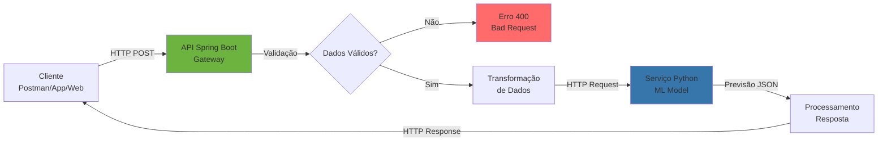
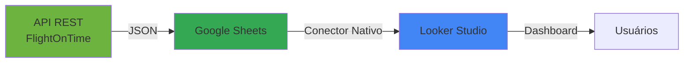
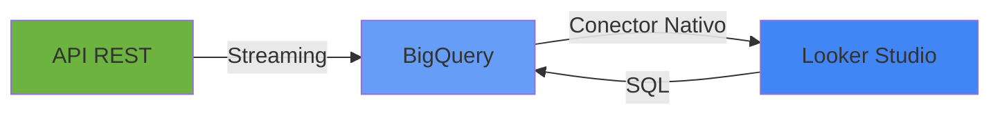

# ✈️ FlightOnTime - Backend API

<div align="center">


**Sistema inteligente de previsão de atrasos de voos usando Machine Learning**

</div>

---

## 📋 Índice

- [Sobre o Projeto](#-sobre-o-projeto)
- [Funcionalidades](#-funcionalidades)
- [Arquitetura](#-arquitetura)
- [Frontend e Visualização de Dados](#-frontend-e-visualização-de-dados)
- [Diagrama da Estrutura](#-diagrama-da-estrutura)
- [Tecnologias Utilizadas](#-tecnologias-utilizadas)
- [Estrutura do Projeto](#-estrutura-do-projeto)
- [Como Executar](#-como-executar)
- [Exemplos de Uso](#-exemplos-de-uso)
- [Planejamento de Desenvolvimento](#-planejamento-de-desenvolvimento)
- [Roadmap](#-roadmap)
- [Contribuindo](#-contribuindo)

---

## 🎯 Sobre o Projeto

**FlightOnTime** é uma API REST desenvolvida em Java com Spring Boot que utiliza Machine Learning para prever se um voo sofrerá atraso ou não. O sistema atua como intermediário inteligente entre aplicações cliente e o modelo de ML, fornecendo previsões precisas e confiáveis.

### Como Funciona

1. 📥 **Você envia** as informações do voo (companhia, origem, destino, data/hora, distância)
2. ⚙️ **A API processa** e valida os dados
3. 🤖 **O modelo de ML analisa** os padrões históricos
4. 📊 **Você recebe** a previsão (Pontual/Atrasado) com a probabilidade

### Objetivo Principal

Desenvolver uma API REST robusta e escalável que:
- Facilite a integração entre aplicações cliente e modelos de ML
- Forneça previsões precisas sobre atrasos de voos
- Garanta a qualidade e segurança dos dados processados
- Ofereça uma experiência de usuário intuitiva

---

## ⚡ Funcionalidades

### Funcionalidades Principais

- ✅ **Previsão de Atrasos**: Análise preditiva baseada em Machine Learning
- 📝 **Validação de Dados**: Validação automática de todos os campos de entrada
- 🔄 **Integração com ML**: Comunicação eficiente com microserviço Python
- 📊 **Respostas Estruturadas**: Retorno padronizado em formato JSON
- 🛡️ **Tratamento de Erros**: Sistema robusto de gerenciamento de exceções
- 📚 **Documentação Interativa**: Swagger/OpenAPI integrado
- 🔒 **Segurança**: Spring Security implementado


---

## 🏗️ Arquitetura

### Visão Geral do Sistema

O FlightOnTime segue uma **arquitetura de microserviços** moderna e escalável:



### Componentes da Arquitetura

#### 1. **API Gateway (Spring Boot)** 🟢
- Expõe endpoints REST públicos
- Valida requisições de entrada
- Gerencia autenticação e autorização
- Trata erros e exceções
- Documenta API com Swagger

#### 2. **Serviço de ML (Python)** 🔵
- Hospeda o modelo de Machine Learning treinado
- Processa requisições de previsão
- Retorna probabilidades e classificações
- Framework: FastAPI ou Flask

#### 3. **Comunicação**
- Protocolo: HTTP/REST
- Formato: JSON
- Timeout configurável
- Retry logic para falhas temporárias

### Fluxo de Requisição Detalhado

```
┌─────────────┐
│   Cliente   │
└──────┬──────┘
       │ 1. POST /api/v1/predict
       ▼
┌─────────────────────────┐
│  PredictionController   │
│  - Recebe Request       │
│  - Valida com @Valid    │
└──────────┬──────────────┘
           │ 2. Delega processamento
           ▼
┌─────────────────────────┐
│   PredictionService     │
│  - Lógica de negócio    │
│  - Transforma dados     │
└──────────┬──────────────┘
           │ 3. Chama serviço externo
           ▼
┌─────────────────────────┐
│    MLServiceClient      │
│  - RestTemplate         │
│  - HTTP POST            │
└──────────┬──────────────┘
           │ 4. Request ao Python
           ▼
┌─────────────────────────┐
│   Serviço Python ML     │
│  - Executa modelo       │
│  - Retorna previsão     │
└──────────┬──────────────┘
           │ 5. Response JSON
           ▼
┌─────────────────────────┐
│   PredictionService     │
│  - Processa resposta    │
│  - Mapeia valores       │
└──────────┬──────────────┘
           │ 6. Retorna ao Controller
           ▼
┌─────────────────────────┐
│  PredictionController   │
│  - Formata Response     │
│  - HTTP 200 OK          │
└──────────┬──────────────┘
           │ 7. Response ao Cliente
           ▼
       ┌────────┐
       │ Cliente│
       └────────┘
```

---

## � Frontend e Visualização de Dados

### Google Looker Studio Integration

O **FlightOnTime** utiliza o **Google Looker Studio** (anteriormente Google Data Studio) como plataforma de visualização e interface frontend, proporcionando uma experiência rica em análise de dados sem a necessidade de desenvolver uma interface web customizada.

#### 🎯 Por que Looker Studio?

**Looker Studio** é uma poderosa ferramenta de Business Intelligence (BI) e visualização de dados do Google que permite criar dashboards interativos, relatórios dinâmicos e visualizações personalizadas com facilidade. A escolha dessa plataforma traz diversos benefícios:

**Vantagens Principais:**

1. **✨ Zero Custo**: Ferramenta 100% gratuita do Google
2. **🚀 Desenvolvimento Rápido**: Dashboards prontos em minutos, não semanas
3. **📊 Visualizações Ricas**: 
   - Gráficos de linha, barra, pizza, mapas geográficos
   - Tabelas dinâmicas com filtros interativos
   - Scorecards para KPIs principais
   - Mapas de calor para análise temporal
4. **☁️ Cloud-Native**: Sem necessidade de instalação ou infraestrutura
5. **🔄 Atualização em Tempo Real**: Dados sempre atualizados automaticamente
6. **📱 Responsivo**: Funciona perfeitamente em desktop, tablet e mobile
7. **🔗 Compartilhamento Fácil**: Links públicos ou privados, incorporação em sites
8. **🔐 Segurança Google**: Controle de acesso via Google Workspace

#### 🔌 Possibilidades de Integração API ↔ Looker Studio

O Looker Studio oferece **múltiplas formas de integração** com nossa API REST:

##### **1. Conectores Nativos do Google**



**Fluxo**:
1. API retorna previsões em formato JSON
2. Script Google Apps Script captura dados e popula Google Sheets
3. Looker Studio conecta-se ao Google Sheets como fonte de dados
4. Dashboards atualizam automaticamente

**Código Apps Script Exemplo**:
```javascript
function fetchFlightPredictions() {
  const url = 'https://api.flightontime.com/api/v1/predict';
  const payload = {
    flightNumber: 'AA1234',
    companyName: 'AA',
    flightOrigin: 'GIG',
    flightDestination: 'GRU',
    flightDepartureDate: new Date().toISOString(),
    flightDistance: 350
  };
  
  const options = {
    method: 'post',
    contentType: 'application/json',
    payload: JSON.stringify(payload)
  };
  
  const response = UrlFetchApp.fetch(url, options);
  const data = JSON.parse(response.getContentText());
  
  // Popula Google Sheets
  const sheet = SpreadsheetApp.getActiveSheet();
  sheet.appendRow([
    new Date(),
    payload.flightNumber,
    data.prediction,
    data.probability * 100
  ]);
}
```

##### **2. Community Connectors (Conectores Personalizados)**

Desenvolvimento de **conector customizado** para integração direta:

- **Linguagem**: Google Apps Script (JavaScript)
- **Autenticação**: OAuth 2.0, API Keys
- **Vantagens**: 
  - Conexão direta sem intermediários
  - Atualização em tempo real
  - Parâmetros dinâmicos (filtros de data, companhia aérea, etc.)

**Estrutura do Conector**:
```javascript
function getConfig() {
  return {
    configParams: [
      {
        type: 'TEXTINPUT',
        name: 'apiUrl',
        displayName: 'FlightOnTime API URL'
      },
      {
        type: 'TEXTINPUT',
        name: 'apiKey',
        displayName: 'API Key',
        secure: true
      }
    ]
  };
}

function getSchema() {
  return {
    schema: [
      {name: 'flightNumber', dataType: 'STRING'},
      {name: 'prediction', dataType: 'STRING'},
      {name: 'probability', dataType: 'NUMBER'},
      {name: 'timestamp', dataType: 'STRING'}
    ]
  };
}

function getData(request) {
  const url = request.configParams.apiUrl + '/api/v1/history';
  const response = UrlFetchApp.fetch(url, {
    headers: {'Authorization': 'Bearer ' + request.configParams.apiKey}
  });
  
  // Transforma resposta JSON para formato Looker Studio
  const data = JSON.parse(response.getContentText());
  return formatData(data, request);
}
```

##### **3. BigQuery como Camada Intermediária**

Para cenários com **alto volume de dados**:



**Benefícios**:
- ✅ Consultas SQL poderosas (agregações, JOINs, window functions)
- ✅ Performance otimizada para grandes volumes (TB de dados)
- ✅ Histórico completo de previsões
- ✅ Análises complexas (tendências temporais, sazonalidade)

**Exemplo de Pipeline**:
```python
# Backend Python enviando dados para BigQuery
from google.cloud import bigquery

def save_prediction_to_bigquery(prediction_data):
    client = bigquery.Client()
    table_id = "flightontime.predictions.history"
    
    rows_to_insert = [{
        "timestamp": datetime.now().isoformat(),
        "flight_number": prediction_data["flightNumber"],
        "prediction": prediction_data["prediction"],
        "probability": prediction_data["probability"],
        "origin": prediction_data["origin"],
        "destination": prediction_data["destination"]
    }]
    
    errors = client.insert_rows_json(table_id, rows_to_insert)
    if not errors:
        print("Data inserted successfully")
```

##### **4. REST API Connector (Beta)**

Google está desenvolvendo conectores REST nativos que permitirão:
- Conexão direta via URL
- Autenticação OAuth/API Key
- Parsing automático de JSON
- Refresh programado

#### 📊 Dashboards e Casos de Uso

**Dashboards Planejados**:

1. **📈 Dashboard de Previsões em Tempo Real**
   - Taxa de atrasos (ON_TIME vs DELAYED)
   - Probabilidade média de atrasos por hora do dia
   - Top 10 rotas com maior risco de atraso
   - Mapa de calor: origem × destino × taxa de atraso

2. **📉 Dashboard de Performance do Modelo**
   - Acurácia do modelo ao longo do tempo
   - Distribuição de probabilidades
   - Matriz de confusão (verdadeiros positivos/negativos)
   - Comparação: previsão vs resultado real

3. **✈️ Dashboard Operacional por Companhia Aérea**
   - Comparativo de desempenho entre companhias
   - Análise de pontualidade por aeroporto
   - Tendências sazonais (feriados, alta temporada)
   - Análise de distância vs taxa de atraso

4. **🔍 Dashboard Analítico Avançado**
   - Série temporal de previsões
   - Correlações (clima, horário, distância)
   - Insights gerados por IA
   - Alertas e anomalias

#### 🚀 Roadmap de Integração Looker Studio

**Fase 1: MVP (Q1 2026)**
- [x] API REST funcional com histórico de previsões
- [ ] Endpoint `/api/v1/history` para consulta de dados históricos
- [ ] Google Sheets como fonte de dados inicial
- [ ] Dashboard básico com métricas principais

**Fase 2: Conector Customizado (Q2 2026)**
- [ ] Desenvolvimento de Community Connector
- [ ] Autenticação via API Key
- [ ] Refresh automático a cada 15 minutos
- [ ] Filtros dinâmicos (data, companhia, rota)

**Fase 3: BigQuery Enterprise (Q3 2026)**
- [ ] Pipeline de streaming para BigQuery
- [ ] Consultas SQL avançadas
- [ ] Dashboards analíticos completos
- [ ] Integração com ML do BigQuery para insights preditivos

#### 📚 Recursos e Documentação

- 📖 [Looker Studio - Getting Started](https://support.google.com/looker-studio)
- 🔌 [Community Connectors Guide](https://developers.google.com/looker-studio/connector)
- 🎓 [BigQuery Integration Best Practices](https://cloud.google.com/bigquery/docs)
- 💡 [Looker Studio Gallery](https://lookerstudio.google.com/gallery) - Templates prontos

---

## �📊 Diagrama da Estrutura

### Estrutura de Pacotes

```
com.backend.fot
│
├── 📱 FotApplication.java          # Classe principal Spring Boot
│
├── 🎮 controller/                   # Camada de Apresentação
│   └── PredictionController.java   # Endpoints REST
│
├── ⚙️ service/                      # Camada de Negócio
│   ├── PredictionService.java      # Lógica de previsão
│   └── MLServiceClient.java        # Cliente HTTP para ML
│
├── 📦 dto/                          # Data Transfer Objects
│   ├── FlightPredictionRequestDTO.java   # Entrada da API
│   ├── FlightPredictionResponseDTO.java  # Saída da API
│   └── MLServiceResponseDTO.java         # Resposta do Python
│
├── 🔢 enums/                        # Enumerações
│   └── FlightPrediction.java       # ON_TIME | DELAYED
│
├── ⚙️ config/                       # Configurações
│   ├── RestTemplateConfig.java     # Bean RestTemplate
│   └── SecurityConfig.java         # Configuração Security
│
└── 🚨 exception/                    # Tratamento de Erros
    ├── GlobalExceptionHandler.java # Handler global
    ├── InvalidRequestException.java
    └── MLServiceException.java
```

### Estrutura de Diretórios Completa

```
FlightOnTime/
│
├── 📄 README.md                    # Documentação principal
├── 📄 LICENSE                      # Licença do projeto
├── 📄 Ideas.txt                    # Ideias e melhorias futuras
│
└── fot/                            # Módulo principal Maven
    ├── 📄 pom.xml                  # Dependências Maven
    ├── 🔧 mvnw                     # Maven Wrapper (Linux/Mac)
    ├── 🔧 mvnw.cmd                 # Maven Wrapper (Windows)
    │
    ├── src/
    │   ├── main/
    │   │   ├── java/
    │   │   │   └── com/backend/fot/
    │   │   │       ├── FotApplication.java
    │   │   │       ├── controller/
    │   │   │       ├── service/
    │   │   │       ├── dto/
    │   │   │       ├── enums/
    │   │   │       ├── config/
    │   │   │       └── exception/
    │   │   │
    │   │   └── resources/
    │   │       ├── application.properties      # Configurações principais
    │   │       ├── application-dev.properties  # Ambiente desenvolvimento
    │   │       └── application-prod.properties # Ambiente produção
    │   │
    │   └── test/
    │       └── java/
    │           └── com/backend/fot/
    │               ├── FotApplicationTests.java
    │               ├── controller/
    │               └── service/
    │
    └── target/                     # Artefatos compilados (gerado)
        ├── classes/
        ├── generated-sources/
        └── test-classes/
```

---

## 🛠️ Tecnologias Utilizadas

### Backend

| Tecnologia | Versão | Descrição |
|------------|--------|-----------|
| ☕ **Java** | 17 | Linguagem de programação |
| 🍃 **Spring Boot** | 3.2.12 | Framework principal |
| 🌐 **Spring Web** | - | Criação de REST APIs |
| 🔒 **Spring Security** | - | Autenticação e autorização |
| ✅ **Spring Validation** | - | Validação de dados |
| 🎨 **Thymeleaf** | - | Template engine |
| 🧰 **Lombok** | - | Redução de boilerplate |
| 🔄 **Spring DevTools** | - | Hot reload em desenvolvimento |

### Documentação

| Tecnologia | Versão | Descrição |
|------------|--------|-----------|
| 📚 **SpringDoc OpenAPI** | 2.7.0 | Documentação Swagger/OpenAPI |

### Build & Deploy

| Ferramenta | Descrição |
|------------|-----------|
| 🔨 **Maven** | Gerenciador de dependências |
| 🐳 **Docker** | Containerização (planejado) |

---

## 📂 Estrutura do Projeto


### Responsabilidades de Cada Camada

#### 🎮 Controller (Camada de Apresentação)

- Recebe requisições HTTP
- Valida dados de entrada com `@Valid`
- Retorna respostas HTTP apropriadas
- **NÃO contém lógica de negócio**

#### ⚙️ Service (Camada de Negócio)

- Processa lógica de negócio
- Transforma dados entre formatos
- Coordena comunicação entre componentes
- Gerencia transações (se necessário)

#### 📦 DTO (Data Transfer Objects)

- Define contratos da API
- Valida dados com Bean Validation
- Garante type-safety
- Facilita serialização JSON

#### 🔢 Enums

- Define valores constantes e válidos
- Melhora legibilidade do código
- Previne erros com valores inválidos

---

## 🚀 Como Executar

### Pré-requisitos

- ☕ **Java 17** ou superior
- 🔨 **Maven 3.8+** (ou usar o Maven Wrapper incluído)
- 🐍 **Python 3.8+** (para o serviço de ML)
- 📦 **Git**

### Passo 1: Clone o Repositório

```bash
git clone https://github.com/Mateus-Redivo/FlightOnTime.git
cd FlightOnTime/fot
```

### Passo 2: Configure o application.properties

Edite o arquivo `src/main/resources/application.properties`:

```properties
# Porta da aplicação
server.port=8080

# URL do serviço Python de ML
ml.service.url=http://localhost:5000/predict
ml.service.timeout=5000

# Logging
logging.level.com.backend.fot=DEBUG
```

### Passo 3: Compile e Execute

#### Usando Maven Wrapper (Recomendado)

```bash
# Linux/Mac
./mvnw clean install
./mvnw spring-boot:run

# Windows
mvnw.cmd clean install
mvnw.cmd spring-boot:run
```

#### Usando Maven Instalado

```bash
mvn clean install
mvn spring-boot:run
```

### Passo 4: Acesse a Aplicação

- 🌐 **API**: `http://localhost:8080`
- 📚 **Swagger UI**: `http://localhost:8080/swagger-ui.html`
- 📖 **API Docs**: `http://localhost:8080/v3/api-docs`

---

## 📝 Exemplos de Uso

### Usando cURL

#### Requisição de Previsão

```bash
curl -X POST http://localhost:8080/api/v1/predict \
  -H "Content-Type: application/json" \
  -d '{
    "flightNumber": "AZ1234",
    "companyName": "AZ",
    "flightOrigin": "GIG",
    "flightDestination": "GRU",
    "flightDepartureDate": "2025-12-20T14:30:00Z",
    "flightDistance": 350
  }'
```

#### Resposta de Sucesso (200 OK)

```json
{
  "prediction": "DELAYED",
  "probability": 0.78
}
```

**Interpretação**: Este voo tem **78% de probabilidade** de atrasar.

### Usando Postman

1. Importe a collection disponível em `/docs/postman_collection.json`
2. Configure a variável `base_url` para `http://localhost:8080`
3. Execute as requisições de exemplo

### Formato dos Dados

#### 📥 Request (FlightPredictionRequestDTO)

| Campo | Tipo | Obrigatório | Validação | Exemplo |
|-------|------|-------------|-----------|---------|
| `flightNumber` | String | ✅ | Max 6 caracteres | "AZ1234" |
| `companyName` | String | ✅ | Exatamente 3 caracteres | "AZ" |
| `flightOrigin` | String | ✅ | Código IATA (3 letras) | "GIG" |
| `flightDestination` | String | ✅ | Código IATA (3 letras) | "GRU" |
| `flightDepartureDate` | Date | ✅ | ISO-8601, futuro/presente | "2025-12-20T14:30:00Z" |
| `flightDistance` | Integer | ✅ | Maior que 0 | 350 |

#### 📤 Response (FlightPredictionResponseDTO)

| Campo | Tipo | Descrição | Valores Possíveis |
|-------|------|-----------|-------------------|
| `prediction` | Enum | Resultado da previsão | `ON_TIME`, `DELAYED` |
| `probability` | Double | Confiança da previsão | 0.0 a 1.0 |

### Tratamento de Erros

#### Erro de Validação (400 Bad Request)

```json
{
  "timestamp": "2025-12-15T14:30:00",
  "status": 400,
  "error": "Bad Request",
  "message": "Validação falhou",
  "errors": [
    {
      "field": "flightOrigin",
      "message": "Código IATA deve ter exatamente 3 caracteres"
    },
    {
      "field": "flightDistance",
      "message": "Distância deve ser maior que 0"
    }
  ]
}
```

#### Serviço ML Indisponível (503 Service Unavailable)

```json
{
  "timestamp": "2025-12-15T14:30:00",
  "status": 503,
  "error": "Service Unavailable",
  "message": "Serviço de previsão temporariamente indisponível"
}
```

---

## 📋 Planejamento de Desenvolvimento


### 📅 Roadmap de Implementação

O desenvolvimento está dividido em **6 fases** progressivas:

```text
Fase 1 ──> Fase 2 ──> Fase 3 ──> Fase 4 ──> Fase 5 ──> Fase 6
  ⬇         ⬇         ⬇         ⬇         ⬇         ⬇
Setup     DTOs    Controller  Service   Errors    Tests
```

---

### 🔧 Fase 1: Configuração Inicial

**Objetivo**: Preparar o ambiente e estrutura base do projeto

#### Atividades

- ✅ Criar projeto Spring Boot via Spring Initializr
- ✅ Configurar `pom.xml` com dependências:
  - Spring Web
  - Spring Boot Validation
  - Spring Security
  - Lombok
  - Spring DevTools
  - SpringDoc OpenAPI
- ✅ Configurar `application.properties`
- ✅ Validar que a aplicação inicia sem erros

#### Resultado da Fase 1

✅ Projeto compila e aplicação Spring Boot inicia com sucesso

---

### 📦 Fase 2: Implementação dos DTOs

**Objetivo**: Criar objetos de transferência de dados

#### Classes a Implementar

1. **FlightPredictionRequestDTO**
   - Campos: `flightNumber`, `companyName`, `flightOrigin`, `flightDestination`, `flightDepartureDate`, `flightDistance`
   - Validações: `@NotNull`, `@NotBlank`, `@Size`, `@Positive`, `@FutureOrPresent`

2. **FlightPredictionResponseDTO**
   - Campos: `prediction` (Enum), `probability` (Double)

3. **MLServiceResponseDTO**
   - Campos: `prediction` (Integer), `probability` (Double)

4. **FlightPrediction (Enum)**
   - Valores: `ON_TIME`, `DELAYED`

#### Resultado da Fase 2

✅ Classes DTO criadas com anotações de validação e documentação Swagger

---

### 🎮 Fase 3: Desenvolvimento do Controller

**Objetivo**: Implementar endpoints REST

#### PredictionController

```java
@RestController
@RequestMapping("/api/v1")
public class PredictionController {
    
    @PostMapping("/predict")
    public ResponseEntity<FlightPredictionResponseDTO> predictDelay(
        @Valid @RequestBody FlightPredictionRequestDTO request
    ) {
        // Delega para o Service
    }
}
```

#### Responsabilidades

- Receber e validar entrada
- Invocar camada de serviço
- Retornar resposta HTTP apropriada
- **Sem lógica de negócio**

#### Resultado da Fase 3

✅ Controller funcional que responde requisições HTTP

---

### ⚙️ Fase 4: Implementação do Service Layer

**Objetivo**: Criar lógica de negócio e integração com ML

#### PredictionService

- Recebe `FlightPredictionRequestDTO`
- Transforma dados para formato do modelo
- Invoca `MLServiceClient`
- Converte resposta: `0 → ON_TIME`, `1 → DELAYED`
- Retorna `FlightPredictionResponseDTO`

#### MLServiceClient

- Configura `RestTemplate`
- Faz chamada HTTP POST para Python
- URL configurável via properties
- Trata timeouts e erros de conexão
- Deserializa JSON

#### Configuração

```properties
ml.service.url=http://localhost:5000/predict
ml.service.timeout=5000
```

#### Resultado da Fase 4

✅ Integração funcional com serviço Python

---

### 🚨 Fase 5: Tratamento de Erros

**Objetivo**: Implementar tratamento robusto de exceções

#### GlobalExceptionHandler (`@ControllerAdvice`)

Trata múltiplos cenários:

| Exceção | Status | Descrição |
|---------|--------|-----------|
| `MethodArgumentNotValidException` | 400 | Validação de entrada falhou |
| `ResourceAccessException` | 503 | Serviço ML indisponível |
| `MLServiceException` | 502 | Erro ao processar previsão |
| `Exception` | 500 | Erro interno genérico |

#### Formato de Erro Padronizado

```json
{
  "timestamp": "2025-12-15T14:30:00",
  "status": 400,
  "error": "Bad Request",
  "message": "Validação falhou",
  "errors": [
    {
      "field": "flightOrigin",
      "message": "Código IATA deve ter 3 caracteres"
    }
  ]
}
```

#### Resultado da Fase 5

✅ API retorna erros estruturados e informativos

---

### 🧪 Fase 6: Testes e Documentação

**Objetivo**: Garantir qualidade e facilitar uso

#### Testes Unitários

- ✅ Testar validações dos DTOs
- ✅ Testar lógica do Service
- ✅ Mockar chamadas ao ML
- ✅ Testar tratamento de exceções

#### Testes de Integração

- Testar endpoint completo
- Usar WireMock para simular Python
- Validar fluxo end-to-end

#### Documentação da API

- ✅ README atualizado
- ✅ Swagger/OpenAPI configurado
- ✅ Collection do Postman
- ✅ Exemplos de cURL

#### Resultado da Fase 6

✅ Testes passando e documentação completa

---

## 🗺️ Roadmap

### ✅ Concluído

- [x] Setup inicial do projeto
- [x] Implementação dos DTOs
- [x] Configuração Spring Security
- [x] Documentação Swagger
- [x] Estrutura de pacotes

### 🔄 Em Progresso

- [ ] Implementação do Controller
- [ ] Implementação do Service Layer
- [ ] Integração com serviço Python ML

### 📅 Planejado

#### Fase Atual (MVP)

- [ ] Tratamento global de exceções
- [ ] Testes unitários completos
- [ ] Testes de integração
- [ ] CI/CD com GitHub Actions

#### Funcionalidades Futuras

- [ ] **Front-end com Looker Studio** 🎯 *Prioridade Alta*
  - Dashboard de previsões em tempo real
  - Análise de performance do modelo
  - Visualizações interativas de rotas e atrasos
  - Integration via Google Sheets ou Community Connector

- [ ] **Persistência de Dados**
  - Integração com PostgreSQL
  - Histórico de previsões
  - Auditoria de requisições
  - Endpoint `/api/v1/history` para consulta de dados históricos

- [ ] **BigQuery Integration** 🚀
  - Pipeline de streaming de previsões
  - Análises SQL avançadas
  - Data Lake para analytics
  - Integração nativa com Looker Studio

- [ ] **Cache e Performance**
  - Redis para cache de previsões
  - Otimização de consultas frequentes

- [ ] **Containerização**
  - Dockerfile para aplicação
  - Docker Compose com Python ML
  - Orquestração com Kubernetes

- [ ] **API Avançada**
  - Endpoint de estatísticas
  - Previsões em batch
  - WebSocket para updates em tempo real

- [ ] **Segurança Avançada**
  - JWT authentication
  - Rate limiting
  - API Keys

---

## 🤝 Contribuindo

Contribuições são bem-vindas! Para contribuir:

1. Fork o projeto
2. Crie uma branch para sua feature (`git checkout -b feature/AmazingFeature`)
3. Commit suas mudanças (`git commit -m 'Add some AmazingFeature'`)
4. Push para a branch (`git push origin feature/AmazingFeature`)
5. Abra um Pull Request

### Padrões de Código

- Siga as convenções de código Java
- Use Lombok para reduzir boilerplate
- Documente métodos públicos
- Escreva testes para novas funcionalidades
- Mantenha cobertura de testes > 80%

---

## 📄 Licença

Este projeto está sob a licença MIT. Veja o arquivo [LICENSE](LICENSE) para mais detalhes.

---

## 👥 Equipe

- **Backend Development**: Java Spring Boot
- **Data Science**: Python ML Model
- **DevOps**: CI/CD & Deployment

---

## 📞 Contato

Para dúvidas ou sugestões:

- **GitHub**: [@Mateus-Redivo](https://github.com/Mateus-Redivo)
- **Issues**: [GitHub Issues](https://github.com/Mateus-Redivo/FlightOnTime/issues)

---

## 🙏 Agradecimentos

- Spring Framework Team
- Comunidade Java/Spring Boot
- Contribuidores do projeto

---

Feito com ❤️ e ☕ pela equipe FlightOnTime

[⬆ Voltar ao topo](#️-flightontime---backend-api)
